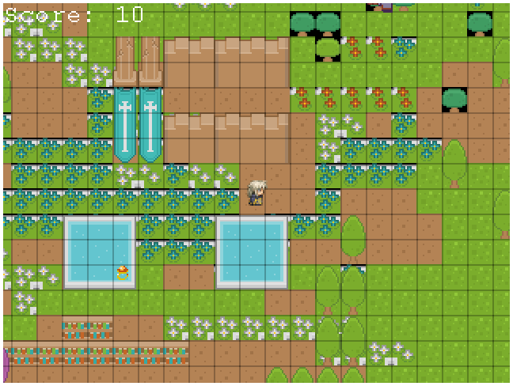
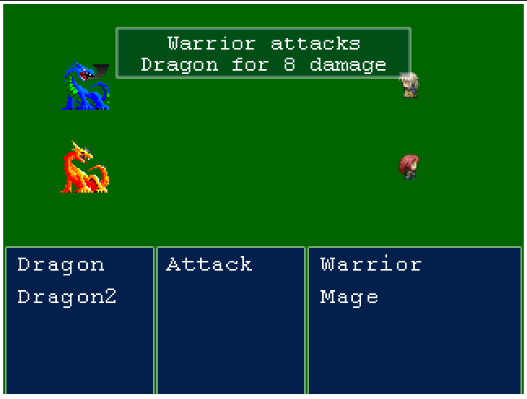
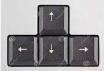

# TheQuest, Simple RPG game.

> The Quest it's a simple RPG game based on Phaser 3 JS Library to build and animate a variety of games.  In "The Quest" your character it's a hired freelance warrior hunting a warlord "BigBoss" Dragon Conjurer. To find him and destroy him, The warrior must fight a host of dragons hidden in the ruins of a ancient city, in the road he will find hidden treasures before the final battle with BigBoss.

# Audience 

> The Quest is a game that can be played by user of all ages, the only requierements it's a computer with internet browser (preferably Chrome or Firefox).

## Built With

- HTML
- CSS
- Javascript
- Phaser 3
- Eslint
- Score API
- Jest

## Live Demo

[The Quest](https://elastic-hopper-db127b.netlify.app/)

## INSTALLATION INSTRUCTIONS

First, please install node in your system [Node install instruction](https://nodejs.org/en/download/package-manager/)

Clone this repository, you can download it as a zip file if you prefer.

Run:  npm install on your terminal to install all the dependencies.

Open the index.html file in the public\dist folder.

## GAME INSTRUCTIONS (how to play)

### Map Exploration

The controls are very simple. You move your character using the arrow keys while moving around the map.
While you explore the map, you will find some items (treasures) grab them!, that will help you to acumulate more points.

### Battle with enemy

When you engage an enemy, you will have to choose the attack using the arrow keys, then using the left arrow you will come to choose the enemy target that you are aiming to, to do this you can use the up and down arrows.

Once you have selected the target, you will confirm the attack, to do this you can use the left arrow, or you could use the spacebar instead.

Enjoy!

## Authors

👤 Carlos Prieto Barron

- Github: [@carlosprietobarron](https://github.com/carlosprietobarron)

## 🤝 Contributing

Contributions, issues and feature requests are welcome!

Feel free to check the [issues page](issues/).

## Show your support

Give a ⭐️ if you like this project!

## Acknowledgments

- Hat tip to anyone whose code was used
- Inspiration
- etc

## 📝 License

This project is [MIT](lic.url) licensed.

